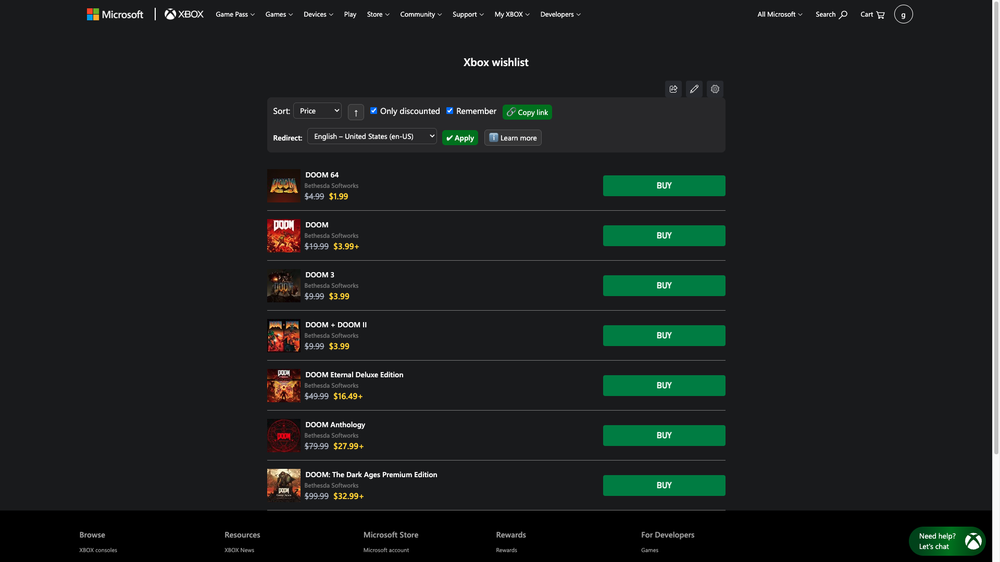
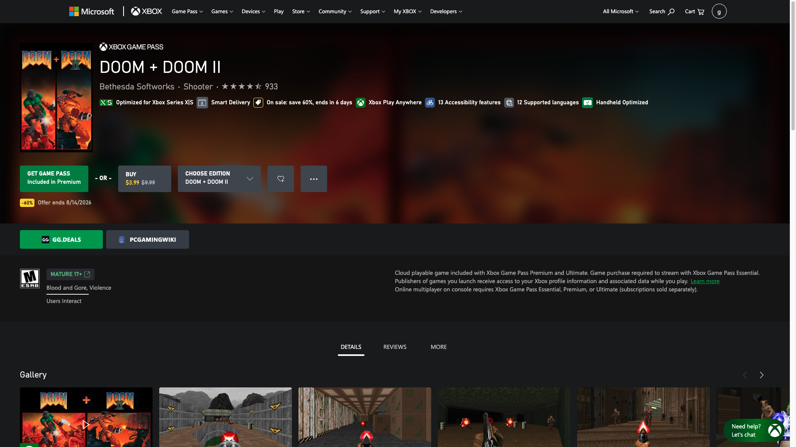

# Xbox Store Locale Redirect

Tampermonkey userscript that redirects the Xbox Store to your country/language and adds wishlist tools. / Userscript de Tampermonkey que redirige Xbox Store a tu país/idioma y añade herramientas a la lista de deseos.

*Wishlist: sort, direction, "only discounted", "remember", copy link, the redirect locale selector with its Apply button, and "Learn more". / Lista de deseos: orden, dirección, "solo con descuento", "recordar", copiar enlace, el selector de locale de redirección con su botón Aplicar, y "Saber más".*

*Game page: the GG.deals and PCGamingWiki buttons, in their own row between the header and the information block, left-aligned with the first button above. / Ficha de juego: los botones de GG.deals y PCGamingWiki, en su propia banda entre la cabecera y el bloque de información, alineados con el primer botón de arriba.*

## English

### What it does

**Region redirect**
- Sends Xbox Store pages — game pages and your wishlist alike — to the **language and country you choose**, so you see prices and text for that region instead of the one Xbox picks for you.
- The selector offers **21 curated locales** (language + country together), so you can only choose combinations the store actually supports. `Auto` means "do not redirect" and leaves the store's own behaviour alone.
- On xbox.com the locale is a **path segment**, so the script rewrites that part of the URL — `/en-us/` becomes whatever you picked.
- The redirect uses a **replace, not a new navigation**, so it leaves no extra history entry and the Back button behaves normally instead of bouncing you forward again.
- A stale or malformed saved locale is **detected and cleared** rather than used, which is what stops a bad value from redirecting in a loop.
- The choice is kept in a **cookie on `.xbox.com`**, so it holds across the whole store rather than just the tab you set it in.
- **Apply** saves your choice and redirects right away, wishlist included.

**Wishlist**
- **Sort** by date added, name, price or discount percentage, with an **↑ / ↓ toggle** for ascending or descending.
- **Only discounted:** hides everything that is not on sale.
- **Remember:** saves your sort and filters and reapplies them when you come back.
- **Copy link:** builds a URL that reproduces your sort and filters when opened. If the browser blocks clipboard access, it shows the URL in a dialog so you can copy it by hand.
- **"Learn more"** button with the full explanation inside the page, and a tooltip on every control.

**Game pages**
- Adds **GG.deals** (prices and deals) and **PCGamingWiki** (compatibility and fixes) buttons as their own row between the header and the information block, left-aligned with the first button above them.
- **PC-playable games only.** A console-only game gets nothing; **Xbox Play Anywhere** does, because it implies PC.
- **No DLC and no apps.** PCGamingWiki has no DLC pages, so linking them would only ever return nothing.
- The platform comes from the page's own **"Play with" list**, whose labels Xbox does not translate. The catalog API cannot supply it: its `PlatformDependencies` field is empty for many games (Forza Horizon 5, Halo Wars 2) and misses PC games outright (Call of Duty: Warzone), while `AllowedPlatforms` says Windows.Desktop for **every** product, console-only ones included.
- The search uses the **English name**, not the title on screen. Xbox translates the page — the URL slug included — while both destinations are indexed in English, so `Forza Horizon 5: Edición Estándar` would find nothing. The name comes from **Microsoft's public catalog**, keyed by the product code in the URL, and is cached in `localStorage`.
- xbox.com is a single-page app, so when you move between games the page lags behind the URL for a moment. Nothing is inserted until the product rendered on screen matches the one in the address, so one game's platform is never paired with another's name.
- GG.deals opens on `/deals/` already filtered to the **Microsoft Store DRM** (`drm=128`), the same convention the Steam, GOG and Epic scripts use with their own, plus `minRating=0` to drop the default store-rating floor that hides part of the deals.
- GG.deals gets the **full title**, edition included, because it has a page per edition — with accents stripped, since GG.deals transliterates its index. PCGamingWiki gets it **without packaging suffixes** (Standard, Deluxe, Premium…), because it documents the base game. Names that are genuinely separate releases — Definitive, Anniversary, Special, Remastered — are left untouched.
- If the catalog does not answer, **no buttons are added**: a button that always lands on zero results is worse than no button.

**Language:** automatic Spanish / English detection, following the language Xbox serves the page in. Note this is separate from the redirect locale: one is the script's own wording, the other is the store's region.

**Install:**
1. Install [Tampermonkey](https://www.tampermonkey.net/).
2. Open the installer: [xbox-store-locale-redirect.user.js](https://github.com/g31w0fw0rld/xbox-store-locale-redirect/raw/main/xbox-store-locale-redirect.user.js) (also on [GreasyFork](https://greasyfork.org/es-419/users/1590477-g31w) and [OpenUserJS](https://openuserjs.org/users/g31w0fw0rldgmail.com/scripts)).

**Sites:** `xbox.com/…/games/store/*`, `xbox.com/…/wishlist`

## Español

### Qué hace

**Redirección de región**
- Lleva las páginas de Xbox Store —tanto las fichas de juego como tu lista de deseos— al **idioma y país que elijas**, para ver precios y textos de esa región en vez de la que Xbox decide por ti.
- El selector ofrece **21 locales curados** (idioma y país juntos), así que solo puedes elegir combinaciones que la tienda realmente soporta. `Auto` significa "no redirigir" y deja el comportamiento propio de la tienda.
- En xbox.com el locale es un **segmento de la ruta**, así que el script reescribe esa parte de la URL: el `/es-mx/` pasa a ser el que hayas elegido.
- La redirección usa un **reemplazo, no una navegación nueva**, así que no deja una entrada extra en el historial y el botón Atrás se comporta con normalidad en vez de devolverte hacia delante.
- Un locale guardado obsoleto o mal formado se **detecta y se borra** en vez de usarse, que es lo que evita que un valor malo redirija en bucle.
- La elección se guarda en una **cookie de `.xbox.com`**, así que vale para toda la tienda y no solo para la pestaña donde la pusiste.
- **Aplicar** guarda tu elección y redirige al momento, lista de deseos incluida.

**Lista de deseos**
- **Ordenar** por fecha de agregado, nombre, precio o porcentaje de descuento, con un **botón ↑ / ↓** para ascendente o descendente.
- **Solo con descuento:** oculta todo lo que no está en oferta.
- **Recordar:** guarda tu orden y tus filtros y los reaplica al volver.
- **Copiar enlace:** genera una URL que al abrirla reproduce tu orden y tus filtros. Si el navegador bloquea el portapapeles, muestra la URL en un diálogo para copiarla a mano.
- Botón **"Saber más"** con la explicación completa dentro de la página, y un tooltip en cada control.

**Fichas de juego**
- Añade botones a **GG.deals** (precios y ofertas) y **PCGamingWiki** (compatibilidad y arreglos) en una banda propia entre la cabecera y el bloque de información, alineados a la izquierda con el primer botón de arriba.
- **Solo en juegos jugables en PC.** Un juego solo de consola no los recibe; **Xbox Play Anywhere** sí, porque implica PC.
- **Nada de DLC ni de aplicaciones.** PCGamingWiki no tiene páginas de DLC, así que enlazarlos solo daría cero resultados.
- La plataforma sale de la propia ficha, de la lista **"Jugar con"**, cuyos rótulos Xbox no traduce. La API de catálogo no puede darla: su campo `PlatformDependencies` viene vacío en muchos juegos (Forza Horizon 5, Halo Wars 2) y deja fuera a juegos de PC (Call of Duty: Warzone), mientras que `AllowedPlatforms` dice Windows.Desktop en **todos** los productos, también en los de solo consola.
- La búsqueda usa el **nombre en inglés**, no el título que ves en pantalla. Xbox traduce la ficha —el slug de la URL incluido— y las dos webs de destino están indexadas en inglés, así que `Forza Horizon 5: Edición Estándar` no encontraría nada. El nombre viene del **catálogo público de Microsoft**, identificando el juego por el código de producto de la URL, y se guarda en `localStorage`.
- xbox.com es una SPA, así que al moverte entre juegos la página va un momento por detrás de la URL. No se inserta nada hasta que el producto pintado en pantalla coincide con el de la dirección, así que nunca se empareja la plataforma de un juego con el nombre de otro.
- GG.deals se abre en `/deals/` ya filtrado por el **DRM de Microsoft Store** (`drm=128`), la misma convención que usan los scripts de Steam, GOG y Epic con el suyo, más `minRating=0` para quitar el mínimo de valoración de tienda que trae por defecto y esconde parte de las ofertas.
- GG.deals recibe el **título completo**, con su edición, porque tiene ficha por edición — sin acentos, porque GG.deals translitera su índice. PCGamingWiki lo recibe **sin sufijos de empaquetado** (Standard, Deluxe, Premium…), porque documenta el juego base. Los nombres que sí son lanzamientos aparte —Definitive, Anniversary, Special, Remastered— se dejan intactos.
- Si el catálogo no responde, **no se ponen los botones**: un botón que siempre cae en cero resultados es peor que no tenerlo.

**Idioma:** detección automática español / inglés, siguiendo el idioma con el que Xbox sirve la página. Ojo, es independiente del locale de redirección: uno es cómo habla el script, el otro es la región de la tienda.

**Instalación:**
1. Instala [Tampermonkey](https://www.tampermonkey.net/).
2. Abre el instalador: [xbox-store-locale-redirect.user.js](https://github.com/g31w0fw0rld/xbox-store-locale-redirect/raw/main/xbox-store-locale-redirect.user.js) (también en [GreasyFork](https://greasyfork.org/es-419/users/1590477-g31w) y [OpenUserJS](https://openuserjs.org/users/g31w0fw0rldgmail.com/scripts)).

**Sitios:** `xbox.com/…/games/store/*`, `xbox.com/…/wishlist`

## Privacy / Privacidad

**EN:** the script declares `@grant none`, so it has no access to the userscript manager's privileged APIs. It makes exactly one kind of external request: on a game page it asks **Microsoft's own public catalog** (`displaycatalog.mp.microsoft.com`) for the English name of the product you are already looking at. That request carries only the product code from the URL, goes out with `credentials: 'omit'` so no cookie or session travels with it, and its answer is cached in `localStorage` so the same game is not asked twice. Your country/language preference is stored in its own cookie (`xbwl-locale`, domain `.xbox.com`, one year) so it applies across the whole store: the cookie holds only the locale you pick, though —like any cookie on that domain— it travels with the requests your browser already makes to `xbox.com`. The wishlist sort order and filters are stored in `localStorage`, and the redirect only changes the URL within the Xbox Store itself. Nothing is sent to third parties or to the author.

**ES:** el script declara `@grant none`, así que no tiene acceso a las APIs privilegiadas del gestor de userscripts. Hace exactamente un tipo de petición externa: en una ficha de juego pregunta al **catálogo público de Microsoft** (`displaycatalog.mp.microsoft.com`) el nombre en inglés del producto que ya estás viendo. Esa petición lleva solo el código de producto de la URL, sale con `credentials: 'omit'` así que no viaja ninguna cookie ni sesión, y su respuesta se guarda en `localStorage` para no preguntar dos veces por el mismo juego. Tu preferencia de país/idioma se guarda en una cookie propia (`xbwl-locale`, dominio `.xbox.com`, un año) para que valga en toda la tienda: la cookie contiene solo el locale que elijas, aunque —como cualquier cookie de ese dominio— viaja en las peticiones que tu navegador ya hace a `xbox.com`. El orden y los filtros de la lista de deseos se guardan en `localStorage`, y la redirección solo cambia la URL dentro de la propia Xbox Store. No se envía nada a terceros ni al autor.

## Support / Apoyar

This is part of something I'm building to grow. If it helps you and you'd like to support it, you can tip me on **[Ko-fi](https://ko-fi.com/g31w0fw0rld)** —only if you want—; and if a cause needs it more than I do, help that one instead.

Esto es parte de algo que estoy construyendo para crecer. Si te sirve y quieres apoyar, puedes invitarme un café en **[Ko-fi](https://ko-fi.com/g31w0fw0rld)** —solo si quieres—; y si hay una causa que lo necesite más que yo, ayúdala a ella.

---
Author / Autor: **g31w0fw0rld** · License / Licencia: **MIT**
